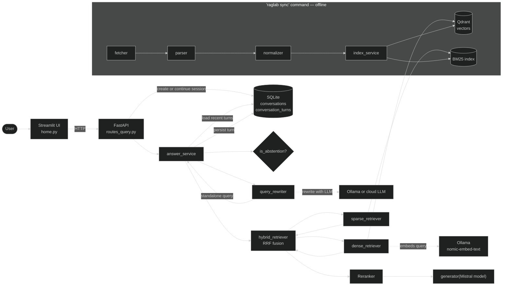
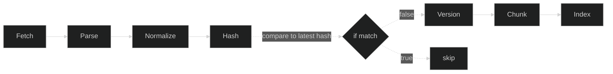
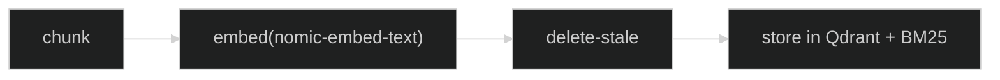
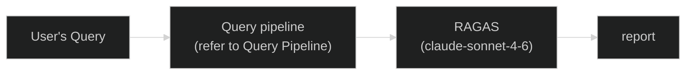

# Overview

- A RAG Pipeline with the Philippine law as its corpus. A personal project that I want to work and experiment on. Currently, it runs using Streamlit as the UI and FastAPI as the API. You can ask questions related to the Philippine law and the model will answer your question and cite the sources, articles, etc where it's located in the Philippine Law. 23 Philippine-law primary sources are indexed (the allowlist in `sources/ph_law_sources.yaml`).

# System Diagram

## Sync Pipeline

## Indexing Pipeline

## Query Pipeline

```mermaid
flowchart LR
%%{init: {'theme':'dark'}}%%
question["user question + optional session_id"] --> history["load recent conversation turns"]
history --> rewrite["rewrite follow-up<br/>to standalone query"]
rewrite --> retrieve["dense + sparse<br/>(Qdrant) (BM25)"]
retrieve --> merge["reciprocal rank fusion(RRF)"]
merge --> rerank["rerank<br/>(ms-marco-MiniLM-L-6-v2)"]
rerank--> gate
gate --> abstain{abstain?}
abstain -.answer.-> generate["Generate (Mistral)"]
abstain -.abstain.-> generate
generate --> persist["persist conversation_turn<br/>question, rewritten_question,<br/>answer, retrieved chunks"]
```

## Eval Pipeline

# Data Flow

1. User asks a question in a Streamlit chat session.
2. The API creates or continues a `session_id`, then `answer_service` loads recent turns from SQLite.
3. Follow-up questions are rewritten into a standalone query before retrieval.
4. The rewritten query passes through BM25 retrieval (sparse) and Qdrant retrieval (dense cosine similarity).
5. Chunks retrieved are merged using RRF (Reciprocal Rank Fusion), then reranked using the cross-encoder model.
6. Top chunks are passed to the generator model with the rewritten query.
7. The answer, original question, rewritten question, and retrieved chunk IDs are persisted to `conversation_turns`.

# Storage

- Qdrant as Vector Store for embeddings
- sqlite3 for documents, chunks, versions, metadata, sync_runs, conversations, conversation_turns
- raw files get saved (html, normalized and hashed) on data/
