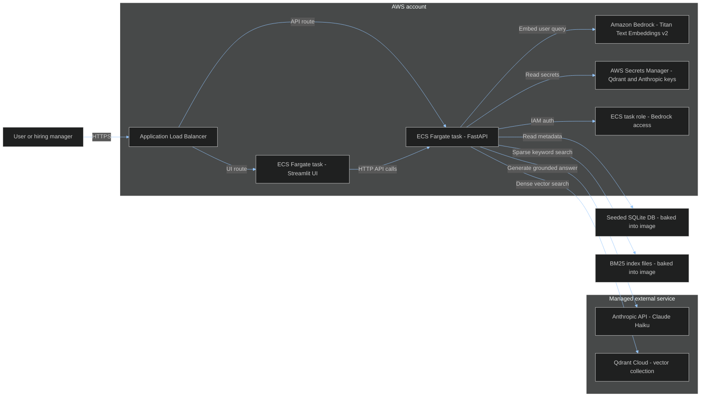
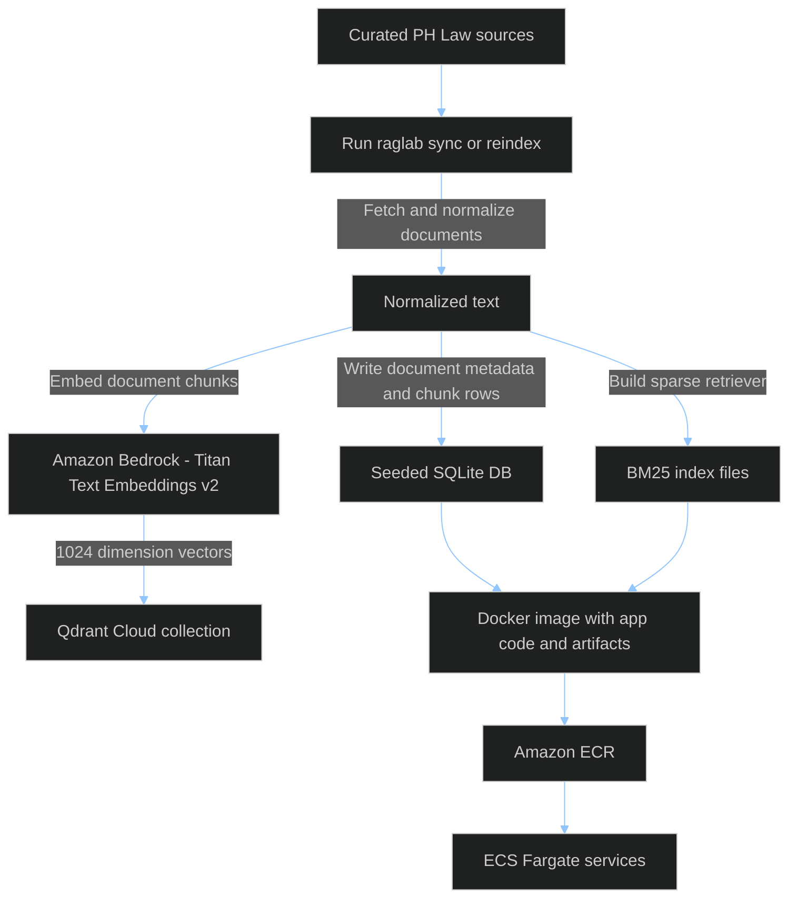
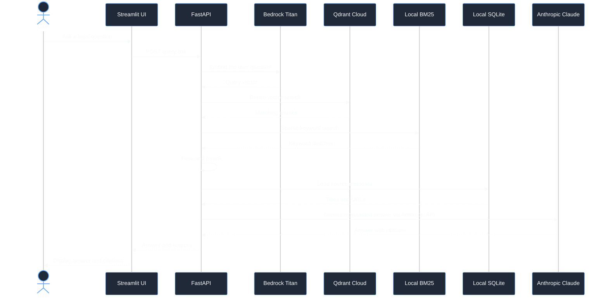

# AWS Deployment Diagram

This deployment runs without Ollama at runtime. The app uses Bedrock for embeddings
and the first-party Anthropic API for generation, Qdrant Cloud for vector search,
and prebuilt SQLite/BM25 artifacts baked into the container image.

## Runtime Architecture

## Build And Indexing Flow

## Request Flow

## Deployment Notes

- ECS Fargate runs the API and UI containers.
- Qdrant Cloud stores vectors, so no Qdrant container runs in AWS.
- Bedrock Titan v2 replaces Ollama for runtime embeddings.
- Generation stays on the first-party Anthropic API because the `generate()`
  seam already routes `claude*` models there and has been evaluated on Haiku 4.5.
- SQLite and BM25 are prebuilt artifacts for the first deploy.
- Conversation history can be ephemeral for v1; move it to durable storage later
  if persistence becomes important.
- A full re-index is required when changing embedding providers or vector
  dimensions.

## Deployment Gate

Do not write CDK or touch ECS until the app passes the local zero-Ollama gate:

1. Configure AWS credentials and enable Bedrock access for Titan Text Embeddings
   v2 (`amazon.titan-embed-text-v2:0`) in `us-east-1`.
2. Create a Qdrant Cloud cluster and API key.
3. Load cloud runtime settings locally with `RAGLAB_ENV_FILE=.env.cloud-gate`.
   The profile sets `EMBEDDING_BACKEND=bedrock`, `QDRANT_URL`,
   `QDRANT_API_KEY`, `QDRANT_COLLECTION=ph_law-titan1024`,
   `LLM_MODEL=claude-haiku-4-5`, `ANTHROPIC_API_KEY`, and
   `AWS_REGION=us-east-1`. The app derives Titan v2
   (`amazon.titan-embed-text-v2:0`) and dimension `1024` from the backend.
4. Disable optional local-model paths for the gate:
   `ENABLE_QUERY_REWRITING=false`, `ANSWERABILITY_GATE_ENABLED=false`,
   `FAITHFULNESS_SELFCHECK_ENABLED=false`, and
   `QUERY_DECOMPOSITION_ENABLED=false`.
5. Stop Ollama completely, then run `raglab reindex`, `raglab ask`, and
   `/health`.

The gate passes only when `raglab reindex` populates the 1024-dim
`ph_law-titan1024` collection in Qdrant Cloud, `raglab ask` returns a grounded
answer, and `/health` is `ok` with `ollama: null`.

## Cost Estimate

Approximate, `us-east-1`, single ALB + 2 Fargate tasks (api + ui), Bedrock for
embeddings, first-party Anthropic for generation, Qdrant Cloud free tier. Verify final numbers in the AWS Pricing
Calculator — pricing varies by region and usage. The dominant cost is **ALB +
Fargate**; Bedrock, Anthropic, and Qdrant are small at demo volume.

| Component                    | Basis                                        | ~Monthly (always-on) |
| ---------------------------- | -------------------------------------------- | -------------------- |
| ALB                          | $0.0225/hr + light LCU                       | ~$18                 |
| Fargate – API                | 0.5 vCPU / 2 GB (room for reranker + torch)  | ~$21                 |
| Fargate – UI                 | 0.25 vCPU / 0.5 GB (Streamlit)               | ~$9                  |
| ECR                          | ~3 GB image storage                          | ~$0.50               |
| Secrets Manager              | 1–2 secrets                                  | ~$0.80               |
| CloudWatch Logs              | low volume                                   | ~$1–2                |
| Bedrock Titan v2 (embed)     | indexing one-time + ~50 tok/query            | <$1                  |
| Anthropic Claude Haiku (gen) | ~2–4K in + ~500 out per query, light traffic | ~$1–3                |
| Qdrant Cloud                 | free tier (1 GB, 1 node)                     | $0                   |
| **Always-on total**          |                                              | **~$50/mo**          |

### The NAT Gateway trap

If Fargate runs in **private** subnets it needs a NAT Gateway for outbound traffic
(to reach Qdrant Cloud, Bedrock, and Anthropic), which adds
**~$32/mo + $0.045/GB** — nearly doubling the bill. **Avoid it:** place the tasks
in **public subnets with a public IP** behind a locked-down security group. No
NAT, same functionality for a demo. Bake this into the CDK stack from day one.

### What you actually pay depends on idle behavior

- **24/7 always-on:** ~$50/mo (public subnets, per table above).
- **ALB up, Fargate scaled to 0 except demos:** ~$20–25/mo (ALB is the stubborn
  fixed cost — it cannot scale to zero behind a service).
- **`cdk destroy` / full teardown between demos:** ~$1–5/mo (just ECR + Secrets +
  a few Bedrock pennies). Redeploy in minutes when needed.

### Levers to cut cost

1. **Public subnets, no NAT** — biggest single save (~$32/mo).
2. **Tear down when idle** — a portfolio demo does not need to run 24/7; scripted
   `cdk deploy`/`destroy` keeps spend near zero between interviews.
3. **Right-size the API task** — the cross-encoder reranker + torch is what forces
   2 GB. Dropping the reranker (or a lighter retrieval path) in the deployed demo
   fits 0.25 vCPU / 0.5 GB and lowers the API task toward ~$18/mo total.
4. **One ALB, path-routed** to both services — not two.
